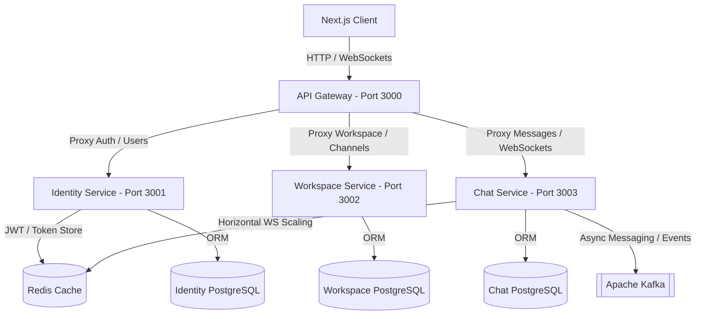

# Portfolio Project Case Study: Slack MVP (Microservice Architecture)

A modern, high-performance, real-time Slack clone designed with a decoupled microservice architecture. This system leverages NestJS for service modules, Next.js for the client-side user experience, and event-driven patterns with Apache Kafka and WebSockets for low-latency communication.

---

## 🚀 Technical Architecture Overview

The system is built on a **Microservices Architecture** utilizing the **Database-per-Service** pattern to guarantee complete independence, scalability, and loose coupling of the services. All public client traffic is channeled through a central **API Gateway**.

### Downstream Backend Microservices

1. **API Gateway (Port 3000)**
   - **Role**: The single entrypoint for the frontend client. It manages unified API routing, CORS policies, and proxies HTTP and WebSocket connections to downstream services.
   - **Mechanism**: Custom NestJS server routing requests utilizing `http-proxy-middleware`.

2. **Identity Service (Port 3001)**
   - **Role**: Handles authentication, user profiles, status settings, and Google OAuth SSO.
   - **Database**: Dedicated PostgreSQL database (`slack_identity_db`).
   - **Caching**: Uses Redis to store active sessions, refresh tokens, and manage blacklisted credentials.

3. **Workspace Service (Port 3002)**
   - **Role**: Handles workspace creation, channel management, permissions, and member invitations (workspace links).
   - **Database**: Dedicated PostgreSQL database (`slack_workspace_db`).

4. **Chat Service (Port 3003)**
   - **Role**: Manages real-time message streams, chat rooms (channels), direct messages (DM), message history, and typing indicators.
   - **Database**: Dedicated PostgreSQL database (`slack_chat_db`).
   - **Real-time Layer**: Socket.IO server utilizing the Redis Adapter for horizontally scaling WebSockets. Integrates Apache Kafka to process background message streams asynchronously.

---

## 🛠️ Technology Stack

| Layer                 | Technologies & Tools                                                   | Key Purpose                                                                      |
| :-------------------- | :--------------------------------------------------------------------- | :------------------------------------------------------------------------------- |
| **Frontend**          | React, Next.js (App Router), TypeScript, TailwindCSS, Socket.IO Client | Client application, real-time WS streaming, and full-bleed layout system.        |
| **Backend**           | NestJS (TypeScript), Express, http-proxy-middleware                    | Modular backend services development and API routing.                            |
| **Database**          | PostgreSQL, TypeORM                                                    | Relational database mapping per microservice.                                    |
| **Caching / Adapter** | Redis                                                                  | Session state, token blacklisting, and WebSocket horizontal distribution.        |
| **Message Broker**    | Apache Kafka (Kafkajs)                                                 | Asynchronous communication and event streaming between services.                 |
| **Media Uploads**     | Cloudinary                                                             | Cloud storage and optimized delivery for user avatars, files, and images.        |
| **DevOps**            | Docker, Docker Compose                                                 | Orchestration of all databases (Postgres x3, Redis, Kafka) and app environments. |

---

## 📊 Database Schema Design

Each service owns its domain schema, conforming to clean relational structures mapped with TypeORM.

### 1. Identity Service Schema

- **`users`**: Contains credentials, profile information, name, status, and custom avatars.
- **`refresh_tokens`**: Supports long-lived refresh tokens for OAuth/custom login flows.

### 2. Workspace Service Schema

- **`workspaces`**: Core workspace definitions owned by a user.
- **`workspace_members`**: Bridges workspaces and users with distinct RBAC roles (`OWNER`, `ADMIN`, `MEMBER`).
- **`channels`**: Workspace channels (public or private).
- **`channel_members`**: Maps users to specific channel access configurations.

### 3. Chat Service Schema

- **`direct_conversations`**: Tracks 1:1 or small group DM sessions.
- **`direct_conversation_members`**: Participants in DMs.
- **`messages`**: Stores message logs, linking to either a `channel_id` or `conversation_id`. Stores message types (`TEXT`, `IMAGE`, `FILE`), Cloudinary asset URLs, edit history, and soft deletion flags.

---

## 💡 Key Portfolios & Resume Bullet Points

Here is how you can describe this project on your Resume/CV to impress hiring managers:

- **Microservices & API Gateway**:

  > _"Architected and deployed a modular Slack clone using a microservices pattern in NestJS. Unified internal service routes (Identity, Workspace, Chat) behind a reverse-proxy API Gateway built with NestJS and `http-proxy-middleware`."_

- **Database-per-Service Pattern**:

  > _"Implemented the Database-per-Service architectural pattern, provisioning 3 separate PostgreSQL databases mapped via TypeORM, ensuring service autonomy and eliminating single points of database failure."_

- **Real-Time Communication**:

  > _"Developed low-latency messaging features (typing indicators, channel feeds, direct messages) via WebSockets (Socket.IO). Leveraged Redis Adapters to enable horizontal scaling of WebSocket servers across multiple application instances."_

- **Event-Driven Microservices**:

  > _"Integrated Apache Kafka to enable asynchronous, event-driven communications between decoupled services, handling message publishing and ingestion pipelines."_

- **SSO & Security**:

  > _"Implemented secure JWT-based authentication (Access & Refresh token pattern) and Google OAuth 2.0 SSO, managing session persistence and token blacklisting using Redis."_

- **Client-Side Rendering (Next.js)**:
  > _"Built a highly responsive Next.js frontend with TailwindCSS, utilizing modern web design guidelines, optimized for real-time WebSocket state management, server-side data fetching, and secure routing."_

Github repo:

- backend: https://github.com/DuvNguyen/slack-backend
- frontend: https://github.com/DuvNguyen/slack-frontend
